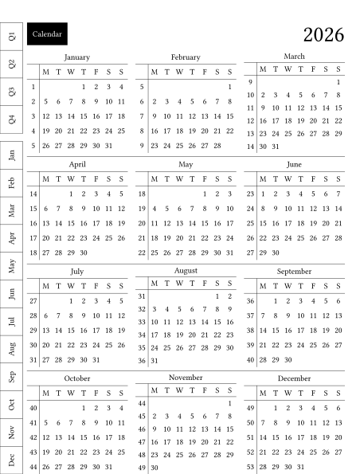
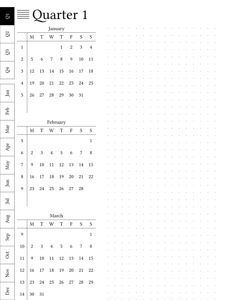
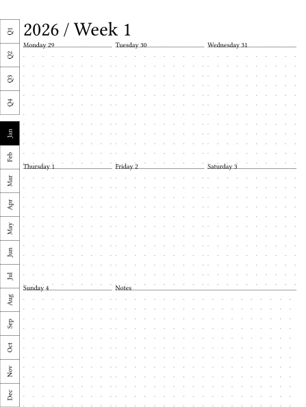
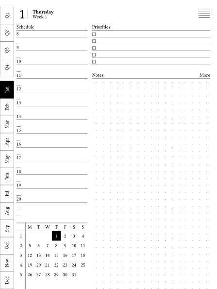
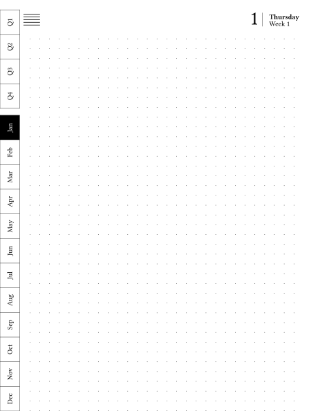

# parch

**Parch** generates yearly planner PDFs for e-ink devices. Python port of Vitaliy Kudryk’s LYP: read a device profile, emit Typst, compile to PDF.

Formerly eink-planner.

This is a port of [Vitaliy Kudryk's LYP (latex-yearly-planner)](https://github.com/kudrykv/latex-yearly-planner/tree/alpha) ([fork point commit](https://github.com/kudrykv/latex-yearly-planner/commit/a59229770cfbf4a05b68a656dd70c02913a7df49), MIT, 2026). LYP generates a yearly planner by emitting **Typst**, then compiling that to **PDF**. This package keeps that architecture: Python reads a **TOML** device profile, walks calendar entities, and writes `index.typst` + `index.pdf`. It does **not** draw PDFs with reportlab/fpdf.

Default device is the **SuperNote Nomad** (A6 X2), MOS strip on the left. A Nomad MOS-right sibling, Kindle Scribe, and 158×210 MOS-left/MOS-right profiles are also shipped.

## Install

Needs [uv](https://docs.astral.sh/uv/) and Python 3.12+.

```shell
cd parch
uv sync
```

`typst` is used to compile the PDF. If it is not on `PATH`, the compile step downloads the official Typst v0.15.1 binary for the current OS/arch into `.tools/typst` (`.tools/typst.exe` on Windows).

## Generate

```shell
# SuperNote Nomad 2026 (default profile, MOS-left) → ./out/index.pdf
uv run parch generate supernote-nomad

# SuperNote Nomad 2027 from the shipped 2026 profile (CLI overlay)
uv run parch generate supernote-nomad --year 2027

# SuperNote Nomad MOS-right → ./out/nomad-mos-right/index.pdf
uv run parch generate supernote-nomad-mos-right -w out/nomad-mos-right

# 158×210 MOS-left → ./out/mos-left/index.pdf
uv run parch generate 158x210-mos-left -w out/mos-left

# 158×210 MOS-left lined → ./out/mos-left-lined/index.pdf
uv run parch generate 158x210-mos-left-lined -w out/mos-left-lined

# 158×210 MOS-right → ./out/mos-right/index.pdf
uv run parch generate 158x210-mos-right -w out/mos-right

# Kindle Scribe → ./out/scribe/index.pdf
uv run parch generate kindle-scribe -w out/scribe
```

Flags:

| Flag | Default | Meaning |
| --- | --- | --- |
| `-w` / `--workdir` | `./out` | Where `index.typst` and `index.pdf` are written |
| `-l` / `--locale` | `en` | Locale code |
| `-g` / `--with-ghostscript` | off | Optional PDF shrink via `gs` |
| `--debug` | off | Draw MOS debug strokes (not a config key) |
| `--year` | file year | Overlay planner year (dates and cover title; not a config key) |

`--year` also rewrites the cover title year when the old year is in the title.

Copy a shipped profile to start a new year or trim sections:

```shell
uv run parch new --from supernote-nomad --year 2027 --yes -o mine.toml
```

`parch new` without `--yes` asks for starting profile, year, sections, and output path. Locale stays `parch generate -l`.

A name in the top-level `sections = ["cover", …]` list is enabled, in that order. Comment a name out of `sections` to disable it. Details live under `[section.<name>]`. There is no `enabled = true` flag, and `debug` does not belong in the profile — use `parch generate --debug`. At least one section must remain.

## Sample pages

2026 from [`158x210-mos-left`](src/parch/data/configs/158x210-mos-left.toml). MOS strip on the left. This profile ships cover, Contents, the calendar sections, and the colophon (no projects, habits, review, tasks, or meetings). Previews are Typst SVGs at half scale. Regenerate with:

```shell
uv run parch preview-svg 158x210-mos-left --samples
```

| Section | Page |
| --- | --- |
| Cover |  |
| Contents |  |
| Annual |  |
| Quarterly |  |
| Monthly |  |
| Weekly |  |
| Daily |  |
| Daily notes |  |
| Colophon |  |

## Device profiles

Sizes are 1:1 on glass at 300 PPI.

| Device | Pixels | Page (pt) | Page (mm) | Config |
| --- | --- | --- | --- | --- |
| SuperNote Nomad (A6 X2) | 1404×1872 | 336.96×449.28 | 118.87×158.5 | `supernote-nomad` |
| SuperNote Nomad MOS-right | 1404×1872 | 336.96×449.28 | 118.87×158.5 | `supernote-nomad-mos-right` |
| 158×210 MOS-left | — | 447.87×595.28 | 158×210 | `158x210-mos-left` |
| 158×210 MOS-left lined | — | 447.87×595.28 | 158×210 | `158x210-mos-left-lined` |
| 158×210 MOS-right | — | 447.87×595.28 | 158×210 | `158x210-mos-right` |
| Kindle Scribe | 1860×2480 | 446.4×595.2 | 157.48×209.97 | `kindle-scribe` |

Presets also live in `parch.devices`. The Nomad profile scales strokes, type, and gutters down slightly from the original 158×210 MOS-left gist so the MOS layout still fits the smaller page.

**MOS** is Months on the Side — the navigation style that places a vertical month menu on the side of the page (as opposed to a top breadcrumb trail).

Shipped configs keep the **MOS** (Months on the Side) layout: side menu on the physical left except 158×210 MOS-right and SuperNote Nomad MOS-right (physical right), reversed months/quarters, Monday week start, daily schedule 8–20, 5 priorities, 2 extra daily note pages, dotted scratch pad on most shipped configs (the 158×210 MOS-left lined sibling uses `scratch_pad = "lined"` under `[style]` with daily on-page notes still dotted). `pattern` is per notes area (dotted default; `lined` is the other option). MOS-left/MOS-right names are the physical MOS strip side (nav left / nav right), not which hand you write with. MOS-left is the right-handed writing layout (nav opposite the writing hand); MOS-right is the left-handed writing layout.

Device profiles and locale files are TOML. Config keys use underscores (`week_starts`, `side_menu`, `daily_notes`); filenames may still use hyphens (`supernote-nomad.toml`).

## Tests

```shell
uv run pytest
```

CI runs pytest and a Nomad `parch generate`. Visual design checks live in `tests/visual.py` and can be dropped with the tests that import them.

## Layout of a generated planner

Enabled MOS (Months on the Side) sections, in order:

1. Cover
2. Annual (12 little calendars)
3. Quarterly
4. Monthly
5. Weekly
6. Daily (schedule + little calendar + priorities + notes)
7. Daily notes (extra dotted pages)
8. Projects (index of write-in names + one kanban board per project)
9. Habits (index of 12 months + one habit-tracker grid per month)
10. Review (index of weeks + one lined leftover-notes page per week; no MOS)
11. Meetings (index of write-in names + one lined page per meeting)
12. Colophon (quiet About page)

`[section.projects]` takes optional `pages` (default 16) and `card_rows` (default 5). Only Nomad ships projects enabled.
`[section.habits]` takes optional `habit_columns` (default 6) and `names` (default `[]`; first N header slots are typeset, the rest stay write-in). Enabled on both Nomad profiles.
`[section.review]` takes optional `weeks_per_page` (default 13). The week field is lined by default and can be `pattern = "dotted"`. Listing `review` without a table uses those defaults. Enabled on both Nomad profiles after Habits.
`[section.meetings]` takes optional `index_pages` (default 1). Enabled on Nomad after Review.

Internal PDF links use Typst `#padded_link` / `<label>` the same way LYP does. A link is only emitted when the target page exists; otherwise the cell stays plain text.

## License

MIT. This is a port of Vitaliy Kudryk's LYP (MIT 2026). See `LICENSE`.
