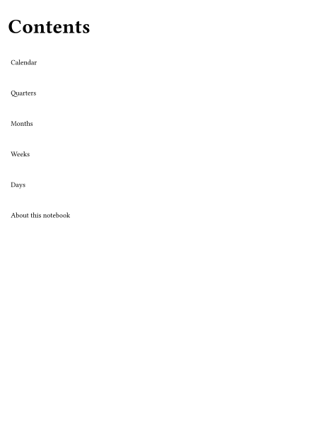
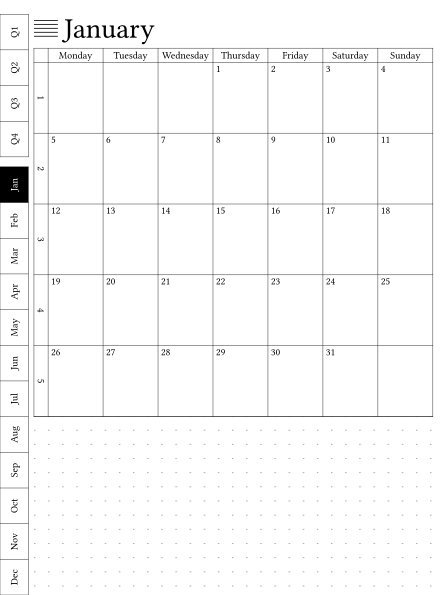

# parch

Yearly planner PDFs for e-ink, a Python port of [Vitaliy Kudryk’s LYP](https://github.com/kudrykv/latex-yearly-planner/tree/alpha).

[](https://pypi.org/project/parch/)
[](https://github.com/yyolk/parch/actions/workflows/ci.yml)

<p>



</p>

## Install

Needs [uv](https://docs.astral.sh/uv/) and Python 3.12+.

```shell
uv tool install parch
parch press supernote-nomad
```

If `typst` is not on `PATH`, press downloads official Typst v0.15.1 into `.tools/`.

## Press

```shell
parch press supernote-nomad
```

| Flag | Default | Meaning |
| --- | --- | --- |
| `-w` / `--workdir` | `./out` | Where `index.typst` and `index.pdf` are written |
| `-l` / `--locale` | `en` | Locale code |
| `-g` / `--with-ghostscript` | off | Optional PDF shrink via `gs` |
| `--debug` | off | Draw MOS debug strokes (not a config key) |
| `--year` | file year | Overlay planner year (dates and cover title; not a config key) |

`--year` also rewrites the cover title year when the old year is in the title.

```shell
parch new --from supernote-nomad --year 2027 --yes -o mine.toml
```

Without `--yes`, `parch new` asks for starting profile, year, sections, and output path. Sections live in the profile `sections` list. Comment a name out to disable it.

## Devices

MOS-left is the right-handed writing layout (nav opposite the writing hand). MOS-right is the left-handed writing layout.

| Profile | Device | Writing hand |
| --- | --- | --- |
| `supernote-nomad` | SuperNote Nomad (A6 X2) | right |
| `supernote-nomad-mos-right` | SuperNote Nomad | left |
| `158x210-mos-left` | 158×210 | right |
| `158x210-mos-left-lined` | 158×210 lined | right |
| `158x210-mos-right` | 158×210 | left |
| `158x210-mos-right-lined` | 158×210 lined | left |
| `kindle-scribe` | Kindle Scribe | right |
| `kindle-scribe-mos-right` | Kindle Scribe | left |

## Development

```shell
uv sync
uv run pytest
```

CI runs pytest and a Nomad `parch press`.

Experimental: compile through the PyPI [`typst`](https://pypi.org/project/typst/) binding instead of the CLI.

```shell
uv sync --extra typst-native
PARCH_TYPST=py uv run parch press supernote-nomad
```

Or `uv tool install --with typst==0.15.0 parch`, then `PARCH_TYPST=py parch press supernote-nomad`. Default is still `cli`. There is no `auto`. The binding is 0.15.0; the CLI pin is v0.15.1.

`uv run pytest` skips the full-book comparison (`slow`). Run it with `uv run pytest -m slow -o addopts=`.

Regenerate the thumbs above with `parch proof 158x210-mos-left --samples`.

Ship steps live in [Releasing](docs/releasing.md).

## License

MIT. See `LICENSE`.
